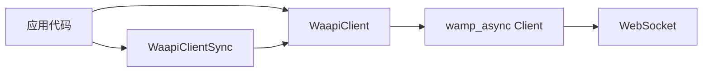

# waapi-rs 开发设计说明

## 目标与范围

- **定位**：waapi-rs 是 Wwise Authoring API (WAAPI) 的 Rust 客户端，通过 WAMP 协议与 Wwise 编辑器通信。
- **目标用户**：需要在 Rust 中调用 WAAPI 的开发者（工具链、自动化、插件等）。
- **范围**：提供连接、RPC 调用 (call)、主题订阅 (subscribe)、WAAPI URI 常量（`ak::*`）及资源清理；不覆盖 WAAPI 的全部高级特性，仅支持当前使用的 WAMP 子集（JSON 序列化、默认 realm 等）。

## 依赖与协议

- **核心依赖**：`wamp_async`（[xmimu/wamp_async](https://github.com/xmimu/wamp_async)，branch: dev），负责 WebSocket 连接与 WAMP 协议。
- **通信方式**：WebSocket + WAMP，序列化使用 JSON；默认 URL `ws://localhost:8080/waapi`，默认 realm `realm1`。
- **运行时**：`tokio`，用于异步 IO 与任务调度；同步客户端内部使用多线程 runtime。

## 架构概览

- 应用层使用 `WaapiClient`（异步）或 `WaapiClientSync`（同步）。
- `WaapiClientSync` 内部持有一个 `tokio::runtime::Runtime` 和 `WaapiClient`，通过 `block_on` 将异步调用转为阻塞。
- `WaapiClient` 持有 `wamp_async::Client` 和事件循环的 `JoinHandle`；事件循环在 `connect` 时由 `tokio::spawn` 启动，在 `cleanup` 或 `Drop` 时被 abort。

## 核心类型职责

| 类型 | 职责 |
|------|------|
| **WaapiClient** | 异步连接（`connect` / `connect_with_url`）、RPC（`call` / `call_no_args`）、订阅（`subscribe` / `subscribe_with_callback`）、生命周期管理（`disconnect`、`cleanup`）；可在多任务间共享（内部用 `Arc` + `Mutex`）。 |
| **WaapiClientSync** | 内部创建并持有多线程 runtime，对外提供同步的 `connect` / `connect_with_url`、`call` / `call_no_args`、`subscribe` / `subscribe_with_callback`、`is_connected`、`disconnect`；适用于非 async 环境。 |
| **SubscriptionHandle** | 持有订阅 ID、与 client 共享的 `Arc`、以及可选的 `recv_task`（`subscribe_with_callback` 时存在）；`unsubscribe()` 显式取消，`Drop` 时也会在后台 spawn 异步取消，避免阻塞。 |
| **SubscriptionHandleSync** | 用于取消同步客户端创建的订阅；`unsubscribe()` 或 drop 时取消订阅并 join 桥接线程；禁止在回调内部 drop，否则可能死锁。 |

## RPC 与 URI 常量

- **call 泛型**：`call<T>(uri, args, options)`、`call_no_args<T>(uri)` 的泛型 `T` 表示**返回值**的反序列化类型，需满足 `Serialize + DeserializeOwned`（如 `serde_json::Value` 或自定义结构体）。返回 `Result<Option<T>, Error>`：成功时 WAAPI 的 kwargs 反序列化为 `T`，无结果时为 `None`；args/options 仍为可序列化类型（通常 `Value` 或 `impl Serialize`）。
- **URI 常量（uris）**：`src/uris.rs` 中按 WAAPI URI 路径组织嵌套模块（`ak::soundengine`、`ak::wwise::core`、`ak::wwise::debug`、`ak::wwise::ui`、`ak::wwise::waapi`），每层提供 `pub const XXX: &str = "ak.xxx.xxx"`。库通过 `pub use uris::ak` 重导出，用户只需 `use waapi_rs::ak`，调用时从 `ak::` 写路径（如 `ak::wwise::core::GET_INFO`），与 C++ WAAPI / 官方 URI 命名一致，便于补全与避免手写字符串。

## 订阅模型

- **`subscribe(topic)`**：返回 `(SubscriptionHandle, UnboundedReceiver<SubscribeEvent>)`。调用方需在单独 task 中消费 receiver；背压由 unbounded channel 缓冲。取消方式：调用 `handle.unsubscribe()` 或 drop handle。
- **`subscribe_with_callback(topic, callback)`**：内部 spawn 一个 task 循环 `recv()` 并调用 `callback(args, kwargs)`；回调在独立 task 中运行，不阻塞事件循环。取消时 `SubscriptionHandle` 会 abort 该 task 并 unsubscribe。
- 两种方式下，drop `SubscriptionHandle` 都会从 client 的 `subscription_ids` 中移除并在后台执行 `unsubscribe`，避免在 `Drop` 里做 `.await`。
- **同步客户端**：`WaapiClientSync::subscribe(topic)` 返回 `(SubscriptionHandleSync, mpsc::Receiver<SubscribeEvent>)`，`subscribe_with_callback(topic, callback)` 返回 `SubscriptionHandleSync`。取消方式为调用 `unsubscribe()` 或 drop 句柄。**注意：不要在回调内部 drop `SubscriptionHandleSync`，否则可能死锁。**

## 资源与生命周期

- **断开顺序**：先对所有已登记订阅执行 `unsubscribe`，再 `leave_realm`，再 `disconnect`；最后 abort 事件循环 task。`cleanup()` 与 `Drop` 均遵循该顺序。
- **Drop 行为**：`WaapiClient` 和 `SubscriptionHandle` 的 `Drop` 在可能的情况下通过 `tokio::runtime::Handle::try_current()` 在已有 runtime 上 `spawn` 异步清理，避免在 drop 中阻塞；若无当前 runtime则仅 abort 事件循环 handle。

## 错误与边界

- **错误类型**：公开 API 使用 `Result<T, Box<dyn std::error::Error>>`，便于与 `wamp_async` 及 IO 错误兼容。
- **“Client already disconnected”**：在 `client` 或 `client.lock().await` 为 `None` 时返回（例如已调用 `disconnect` 或 `cleanup` 之后再次 call/subscribe）。
- **测试**：部分测试依赖本机 WAAPI（Wwise 已启动且启用 Authoring API）；若连接失败则 `eprintln` 说明并 return，不 panic，实现“可选 WAAPI 的 CI 友好”的跳过策略。

## 与 Python waapi-client 的对应关系

| Python (waapi-client-python) | waapi-rs |
|------------------------------|----------|
| `WaapiClient()` / `connect()` | `WaapiClient::connect().await` 或 `WaapiClientSync::connect()` |
| `client.call(uri, options=...)` | `client.call::<T>(uri, args, options)` 或 `call_no_args::<T>(uri)`，泛型 `T` 为返回值类型，返回 `Result<Option<T>, Error>`；URI 可用常量如 `ak::wwise::core::GET_INFO` |
| `client.subscribe(topic, callback)` | `subscribe_with_callback(topic, \|args, kwargs\| { ... })` 或 `subscribe(topic)` + 自行消费 receiver；主题可用 `ak::wwise::ui::SELECTION_CHANGED` 等 |
| `handler.unsubscribe()` | `handle.unsubscribe().await` 或 drop `SubscriptionHandle` |
| `client.disconnect()` | `client.disconnect().await` 或 drop `WaapiClient` |

便于从 Python 迁移时对照使用。

## 未来可扩展方向（可选）

- 常用 WAAPI URI 已以 `ak::*` 常量形式提供；可进一步做类型化封装（如按 URI 的 schema 生成请求/响应结构体）。
- 可配置 SSL 校验与 realm。
- 重连策略与连接状态回调。
